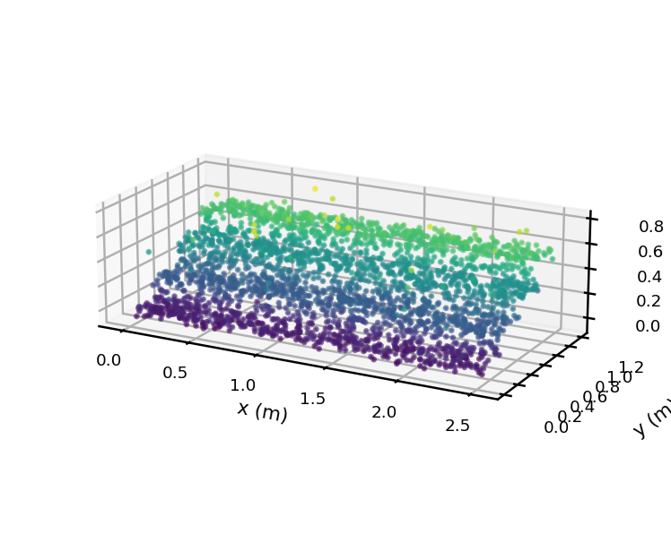
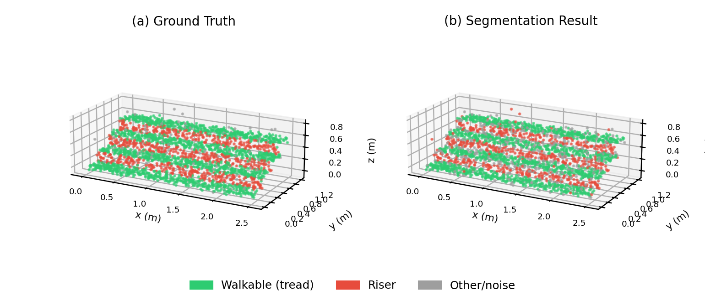
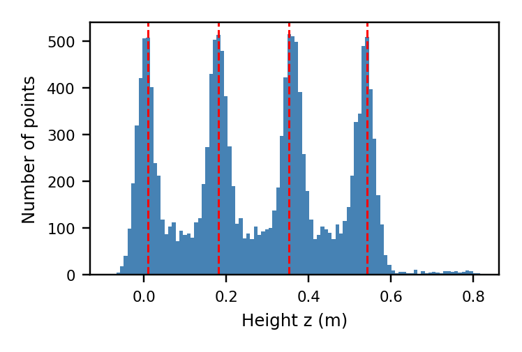
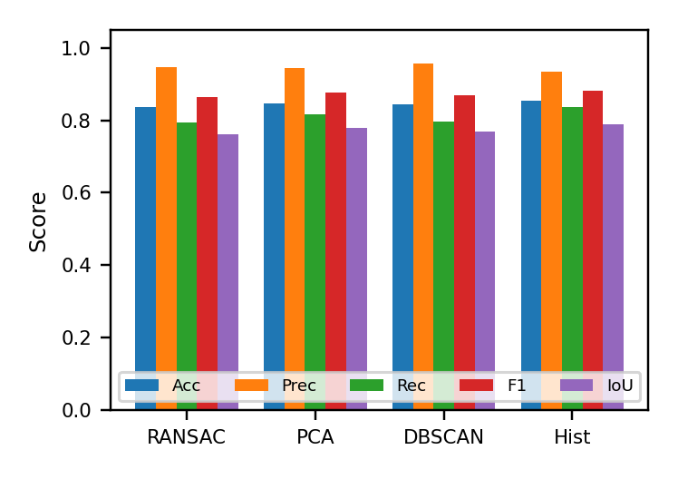
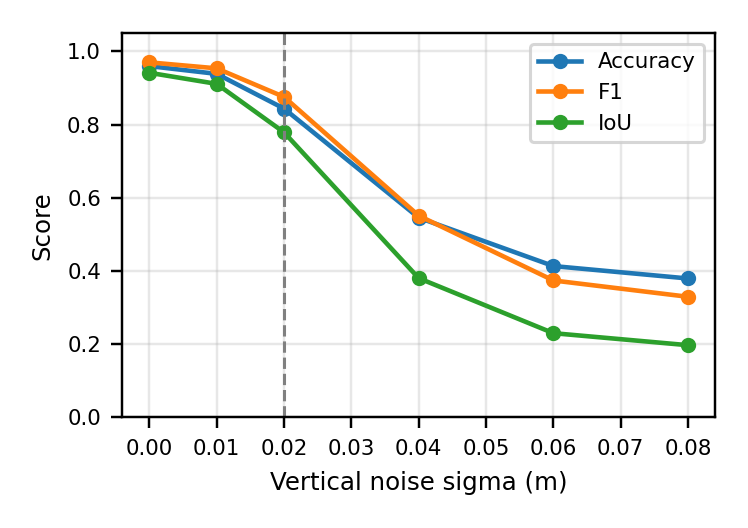

# A Comparative Study of Point-Cloud Segmentation Methods for Walkable Tread Detection on Staircases under Sensor Noise

Studi perbandingan **empat metode segmentasi *point cloud*** untuk mendeteksi permukaan **pijakan (tread)** yang aman dilangkahi robot pemanjat tangga (*stair-climbing robot*), beserta **analisis sensitivitas terhadap noise sensor**. Proyek membangkitkan *point cloud* tangga 4 anak tangga secara sintetis dari persamaan geometris (lengkap dengan *ground-truth label*), menambahkan noise LiDAR + outlier, lalu mengevaluasi tiap metode dengan metrik kuantitatif (Accuracy, Precision, Recall, F1, IoU).

> Tugas mata kuliah Sensor & Perception — diimplementasikan dengan NumPy/SciPy/scikit-learn murni (tanpa Open3D), sehingga dapat dijalankan langsung di Google Colab.

---

## Daftar Isi
- [Latar Belakang](#latar-belakang)
- [Kontribusi](#kontribusi)
- [Struktur Repositori](#struktur-repositori)
- [Pipeline & Metodologi](#pipeline--metodologi)
- [Hasil Utama](#hasil-utama)
- [Visualisasi](#visualisasi)
- [Cara Menjalankan](#cara-menjalankan)
- [Dependensi](#dependensi)
- [Sitasi](#sitasi)
- [Penulis](#penulis)

---

## Latar Belakang

Robot pemanjat tangga memerlukan persepsi 3D yang andal untuk membedakan permukaan **horizontal (tread / pijakan yang dapat dilangkahi)** dari permukaan **vertikal (riser)** serta tepi tangga yang berbahaya. Kesalahan mengidentifikasi permukaan ini dapat menyebabkan robot tergelincir atau jatuh, sehingga akurasi segmentasi menjadi faktor keselamatan yang kritis.

Karena data tangga ber-*ground-truth* sulit diperoleh, proyek ini menggunakan **data sintetis berbasis persamaan** sehingga label kebenaran tersedia penuh dan metrik dapat dihitung secara objektif. Pertanyaan riset: **seberapa andal segmentasi geometris klasik untuk menandai area aman, dan apakah cukup sebagai satu-satunya jaminan keselamatan robot?**

Analisis lengkap tersedia pada makalah format IEEE:
**[`Muhammad_Nizam_A_Paper_IEEE.pdf`](./Muhammad_Nizam_A_Paper_IEEE.pdf)**

---

## Kontribusi

1. **Benchmark sintetis terkontrol & berlabel penuh** untuk *point cloud* tangga, dengan noise dan outlier yang dapat diatur.
2. **Perbandingan terpadu dan reproducible** atas empat metode segmentasi klasik pada kondisi yang identik.
3. **Studi sensitivitas noise sensor** disertai analisis berorientasi keselamatan terhadap *precision* kelas *walkable* yang dibutuhkan robot.

---

## Struktur Repositori

```
tugas_sensor/
├── Source Code/
│   └── Staircase_PointCloud_Segmentation_EN.ipynb   # Notebook utama (end-to-end)
├── Figure/
│   ├── fig_raw.png        # Point cloud mentah (diwarnai berdasarkan ketinggian)
│   ├── fig_seg.png        # Hasil segmentasi: ground truth vs prediksi
│   ├── fig_hist.png       # Histogram ketinggian + puncak tread terdeteksi
│   ├── fig_metrics.png    # Perbandingan metrik antar-metode
│   └── fig_noise.png      # Sensitivitas performa terhadap noise
├── Presentation/                                     # Slide presentasi
└── Muhammad_Nizam_A_Paper_IEEE.pdf                   # Makalah format IEEE
```

---

## Pipeline & Metodologi

### 1. Pembangkitan Point Cloud (Parametrik)

Tangga dimodelkan 4 anak tangga dengan parameter geometris berikut:

| Parameter | Simbol | Nilai |
|---|---|---|
| Lebar tangga (sumbu-x) | `w` | 2.5 m |
| Kedalaman pijakan (sumbu-y) | `d` | 0.30 m |
| Tinggi anak tangga (sumbu-z) | `h` | 0.18 m |
| Jumlah anak tangga | `n` | 4 |
| Std. deviasi noise vertikal | `σz` | 0.02 m |
| Std. deviasi noise LiDAR | `σL` | 0.005 m |
| Fraksi outlier | — | 4 % |

**Permukaan pijakan / tread** (horizontal, untuk i = 0..3):

```
x ~ Uniform(0, w)
y ~ Uniform(i·d, (i+1)·d)
z = i·h + εz,   εz ~ N(0, σz²)
```

**Permukaan tegak / riser** (vertikal, untuk i = 1..3):

```
x ~ Uniform(0, w)
y = i·d + εy,   εy ~ N(0, σy²)
z ~ Uniform((i-1)·h, i·h)
```

Setiap titik kemudian diberi **noise LiDAR isotropik** `N(0, σL²)` pada ketiga sumbu, lalu ditambahkan **4% outlier** acak di seluruh *bounding box*. Hasil akhir **15.808 titik**: 10.400 tread, 4.800 riser, dan 608 other/noise. Label kebenaran: `0 = Other/Noise`, `1 = Tread (walkable)`, `2 = Riser`.

### 2. Estimasi Vektor Normal

Normal tiap titik diestimasi via **PCA lokal** pada *k* tetangga terdekat (`k = 30`, memakai `scipy.spatial.cKDTree`). Normal adalah *eigenvector* dengan *eigenvalue* terkecil dari matriks kovarians lokal. Komponen vertikal `|n_z|` menjadi indikator orientasi: `|n_z| → 1` menandakan permukaan horizontal (tread), `|n_z| → 0` menandakan permukaan vertikal (riser).

### 3. Empat Metode Segmentasi

| # | Metode | Ide Inti & Parameter |
|---|--------|----------------------|
| 1 | **RANSAC + Normal** | Mencocokkan bidang horizontal (kandidat diterima bila `\|n_z\| > 0.9`, threshold inlier `τ = 0.02 m`), dipadu kendala konsistensi normal `\|n_z\| > 0.8` agar tidak menyatukan titik riser yang sebidang. |
| 2 | **PCA + Normal** | Klasifikasi langsung dari `\|n_z\|` dengan ambang `τh = 0.85` (tread) dan `τv = 0.35` (riser); di antaranya dianggap edge/transisi. |
| 3 | **DBSCAN + Slope** | DBSCAN (`ε = 0.04 m`, `min_samples = 10`) terutama sebagai **penolak outlier**; titik valid diklasifikasi via analisis kemiringan normal. |
| 4 | **Height Histogram** | Memanfaatkan distribusi `z` yang multimodal; memilih `n` puncak tertinggi berjarak > 8 cm sebagai level tread, lalu menandai titik dalam toleransi ±0.04 m dengan `\|n_z\| > 0.75`. Puncak terdeteksi: **0.009, 0.181, 0.352, 0.542 m** (sangat dekat dengan kelipatan ideal `h`). |

### 4. Evaluasi

Performa diukur pada **kelas walkable (tread sebagai kelas positif)** memakai **Accuracy, Precision, Recall, F1, dan IoU** berbasis TP/FP/FN/TN.

### 5. Studi Sensitivitas Noise

Noise vertikal `σz` disapu dari 0 hingga 0.08 m, lalu pipeline analisis normal dijalankan ulang untuk mengukur degradasi performa.

---

## Hasil Utama

**Tabel II — Perbandingan performa segmentasi untuk kelas *walkable*:**

| Metode | Acc | Prec | Rec | F1 | IoU |
|---|---|---|---|---|---|
| RANSAC + Normal | 0.836 | 0.947 | 0.795 | 0.864 | 0.761 |
| PCA + Normal | 0.848 | 0.944 | 0.816 | 0.876 | 0.779 |
| DBSCAN + Slope | 0.843 | **0.957** | 0.798 | 0.870 | 0.770 |
| **Height Histogram** | **0.854** | 0.935 | **0.836** | **0.883** | **0.790** |

- **Height Histogram** memberikan **F1 (0.883)** dan **IoU (0.790)** tertinggi; **DBSCAN** memberi **precision** tertinggi (0.957).
- **Seluruh metode** mencapai **precision > 0.93** — area yang ditandai walkable hampir selalu benar-benar tread.
- **RANSAC murni** cenderung menggabungkan bidang miring antar anak tangga; baru andal setelah dipadukan konsistensi normal. **DBSCAN spasial murni** menyatukan tread–riser yang bersentuhan, sehingga paling tepat digunakan sebagai penolak outlier.

**Sensitivitas noise (pipeline normal analysis):** performa menurun **monoton** seiring `σz` naik —
F1 turun dari **0.970** (tanpa noise) → **0.875** (`σz = 0.02 m`) → **0.551** (`σz = 0.04 m`) → **0.329** (`σz = 0.08 m`). Noise besar merusak estimasi normal lokal sehingga ambang orientasi tak lagi memisahkan tread dan riser dengan andal.

**Implikasi keselamatan robot:** *precision* lebih kritis daripada *recall* (false positive pada area pijakan berbahaya). Precision ~0.94 sudah baik, namun untuk deployment nyata sebaiknya dinaikkan **> 0.99** melalui *edge filtering*, *morphological erosion* area tread, dan margin keselamatan geometris. Hasil ini **memadai sebagai lapisan persepsi awal**, tetapi **belum cukup sebagai satu-satunya jaminan keselamatan** — perlu fusi sensor (IMU + kamera), verifikasi temporal multi-scan, margin geometris, dan *fail-safe* berbasis kontak.

---

## Visualisasi

| Point cloud mentah | Hasil segmentasi (ground truth vs prediksi) |
|---|---|
|  |  |

| Height histogram | Perbandingan metrik | Sensitivitas noise |
|---|---|---|
|  |  |  |

---

## Cara Menjalankan

### Opsi A — Google Colab (disarankan)
1. Unggah `Source Code/Staircase_PointCloud_Segmentation_EN.ipynb` ke Google Colab.
2. Jalankan seluruh sel (`Runtime → Run all`). Semua dependensi sudah tersedia bawaan Colab.

### Opsi B — Lokal (Jupyter)
```bash
git clone git@github.com:MRZ8716/tugas_sensor.git
cd tugas_sensor

python -m venv .venv && source .venv/bin/activate
pip install numpy scipy scikit-learn matplotlib jupyter

jupyter notebook "Source Code/Staircase_PointCloud_Segmentation_EN.ipynb"
```

Notebook bersifat **deterministik** (`np.random.default_rng(42)`), sehingga hasil dapat direproduksi.

---

## Dependensi

- Python ≥ 3.10
- `numpy`
- `scipy` (`cKDTree`)
- `scikit-learn` (`DBSCAN`)
- `matplotlib`

`open3d` **tidak** diperlukan (opsional, dinonaktifkan di notebook).

---

## Sitasi

Jika menggunakan kode atau hasil dari repositori ini, silakan rujuk makalah terlampir:

```bibtex
@misc{anshori_staircase_segmentation,
  author = {Muhammad Nizam Al Anshori},
  title  = {A Comparative Study of Point-Cloud Segmentation Methods for Walkable Tread Detection on Staircases under Sensor Noise},
  year   = {2025},
  note   = {Master Program of Information and Computer Engineering,
            Electronics Engineering Polytechnic Institute of Surabaya (EEPIS/PENS)}
}
```

---

## Penulis

**Muhammad Nizam Al Anshori**
Master Program of Information and Computer Engineering
Electronics Engineering Polytechnic Institute of Surabaya (EEPIS/PENS), Surabaya, Indonesia
Email: nizam90@pasca.student.pens.ac.id
GitHub: [@MRZ8716](https://github.com/MRZ8716)
